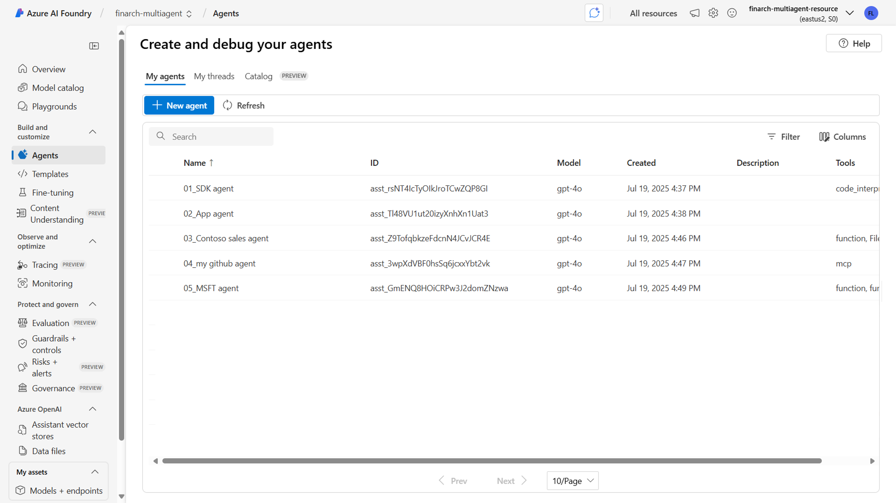

# 🚀 Azure AI Agent

本專案示範如何使用 Azure AI Agent 進行多種 AI 任務，包含基礎、中階、進階，以及與 MCP 整合的應用。

Please see [the English version](#azure-ai-agent) at the bottom.

## 一、專案下載與進入資料夾

### 1. 下載本專案：
   ```bash
   git clone https://github.com/ownway22/azure-ai-agent.git
   ```
### 2. 進入專案資料夾：
   ```bash
   cd azure-ai-agent
   ```

## 二、環境建置 方法一

### 1. 建立虛擬環境

建議使用 Python 3.9 以上版本。

Windows PowerShell 指令：
```powershell
python -m venv .venv
```

### 2. 啟用虛擬環境

Windows PowerShell 指令：
```powershell
.venv\Scripts\Activate
```

若使用 CMD：
```cmd
.venv\Scripts\activate.bat
```

若使用 macOS/Linux：
```bash
source .venv/bin/activate
```

### 3. 安裝所需套件

```bash
pip install -r requirements.txt
```

## 二、環境建置 方法二

### 使用 uv sync 快速建立虛擬環境

若您已安裝 uv，可用以下方式快速建立與安裝虛擬環境：

```bash
uv sync
```

- `uv sync`：根據 pyproject.toml 建立虛擬環境，並自動安裝所有套件

啟用虛擬環境後即可依前述步驟執行範例。

## 三、執行範例

1. 建議依序閱讀與執行下列檔案：
   - 01_ai-agent-basic.ipynb
   - 02_ai-agent-intermediate.py
   - 03_ai-agent-advanced.py
   - 04_ai-agent-mcp-basic.ipynb
   - 05_ai-agent-mcp-intermediate.py
   - 06_ai-agent-mcp-advanced.py

2. 若要執行 Jupyter Notebook（如 01_ai-agent-basic.ipynb）：
   ```bash
   pip install notebook
   jupyter notebook
   ```
   然後在瀏覽器中開啟 01_ai-agent-basic.ipynb、04_ai-agent-mcp-basic.ipynb。

3. 執行 Python 腳本範例：
   ```bash
   python 02_ai-agent-intermediate.py
   python 03_ai-agent-advanced.py
   python 05_ai-agent-mcp-intermediate.py
   python 06_ai-agent-mcp-advanced.py
   ```

## 四、完成後的結果

當所有程式碼執行完成後，您可以在 Azure AI Foundry portal 的 agent 清單中看到如下畫面。該畫面顯示已成功建立的 agent 清單，包含其名稱、ID、模型類型、建立時間等資訊。



## 其他說明

- 請參考各 .py 檔案內的註解與說明，根據需求調整參數。
- 若需設定環境變數，請參考 `.env` 檔案。

---

# Azure AI Agent

This project demonstrates how to use Azure AI Agent for various AI tasks, including basic, intermediate, advanced, and MCP-integrated applications.

## Project Download and Navigate to Folder

### 1. Download the project:
   ```bash
   git clone https://github.com/ownway22/azure-ai-agent.git
   ```
### 2. Navigate to the project folder:
   ```bash
   cd azure-ai-agent
   ```

## 2. Environment Setup Method 1

### 1. Create a Virtual Environment

Python 3.9 or above is recommended.

Windows PowerShell command:
```powershell
python -m venv .venv
```

### 2. Activate the Virtual Environment

Windows PowerShell command:
```powershell
.venv\Scripts\Activate
```

For CMD:
```cmd
.venv\Scripts\activate.bat
```

For macOS/Linux:
```bash
source .venv/bin/activate
```

### 3. Install Required Packages

```bash
pip install -r requirements.txt
```

## 2. Environment Setup Method 2

### Use `uv sync` for Quick Virtual Environment Setup

If you have `uv` installed, you can quickly set up and install the virtual environment using:

```bash
uv sync
```

- `uv sync`: Creates a virtual environment based on `pyproject.toml` and automatically installs all packages.

After activating the virtual environment, you can follow the steps above to run the examples.

## 3. Run Examples

1. It is recommended to read and execute the following files in order:
   - 01_ai-agent-basic.ipynb
   - 02_ai-agent-intermediate.py
   - 03_ai-agent-advanced.py
   - 04_ai-agent-mcp-basic.ipynb
   - 05_ai-agent-mcp-intermediate.py
   - 06_ai-agent-mcp-advanced.py

2. To run Jupyter Notebook (e.g., 01_ai-agent-basic.ipynb, 04_ai-agent-mcp-basic.ipynb):
   ```bash
   pip install notebook
   jupyter notebook
   ```
   Then open `01_ai-agent-basic.ipynb` or `04_ai-agent-mcp-basic.ipynb` in your browser.

3. Run Python script examples:
   ```bash
   python 02_ai-agent-intermediate.py
   python 03_ai-agent-advanced.py
   python 05_ai-agent-mcp-intermediate.py
   python 06_ai-agent-mcp-advanced.py
   ```

## 4. Results After Completion

After executing all the code, you can see the agent list in the Azure AI Foundry portal as shown in the `complete.png` image. This screen displays the list of successfully created agents, including their names, IDs, model types, creation times, and other information.


## Additional Notes

- Refer to the comments and instructions in each `.py` file to adjust parameters as needed.
- If environment variables need to be set, refer to the `.env` file.

---

## Reference

### 01_ai-agent-basic.ipynb
1. [Quickstart - Create a new Azure AI Foundry Agent Service project (2025/07/11)](https://learn.microsoft.com/en-us/azure/ai-foundry/agents/quickstart?pivots=programming-language-python-azure)
2. [Azure AI Projects client library for Python - version 1.0.0b12 (2025/06/27)](https://learn.microsoft.com/en-us/python/api/overview/azure/ai-projects-readme?view=azure-python-preview)
3. [Azure AI Agents client library for Python - version 1.0.2 (2025/07/01)](https://learn.microsoft.com/en-us/python/api/overview/azure/ai-agents-readme?view=azure-python)

### 02_ai-agent-intermediate.py
4. [azure-sdk-for-python by dargilco (2025/06)](https://github.com/Azure/azure-sdk-for-python/tree/azure-ai-projects_1.0.0b12/sdk/ai/azure-ai-agents/samples/agents_async)

### 03_ai-agent-advanced.py
5. [Build your code-first agent with Azure AI Foundry](https://microsoft.github.io/build-your-first-agent-with-azure-ai-agent-service-workshop/)

### 04_ai-agent-mcp-basic.ipynb
6. [Announcing Model Context Protocol Support (preview) in Azure AI Foundry Agent Service | Azure AI Foundry Blog (2025/06/27)](https://devblogs.microsoft.com/foundry/announcing-model-context-protocol-support-preview-in-azure-ai-foundry-agent-service/)
7. [Code Samples for the Model Context Protocol Tool (Preview) - Azure AI Foundry | Microsoft Learn (2025/07/18)](https://learn.microsoft.com/en-us/azure/ai-foundry/agents/how-to/tools/model-context-protocol-samples?pivots=python)
8. [Create a Remote MCP server for your GitHub repository](https://gitmcp.io/)

### 05_ai-agent-mcp-intermediate.py
9. [QuickStart to MCP Tools Development with Azure AI Foundry SDK (2025/07/12)](https://techcommunity.microsoft.com/blog/azure-ai-services-blog/ai-agent-mcp-tools-quickstart-to-mcp-tools-development-with-azure-ai-foundry-sdk/4432464)
10. [AI-Foundry-Agent-MCP by Christian Coello (2025/07)](https://github.com/ccoellomsft/AI-Foundry-Agent-MCP)

### 06_ai-agent-mcp-advanced.py
11. [Build a MCP client using Azure AI Foundry and OpenAI Agents SDK (2025/04/27)](https://medium.com/@eitansela/build-a-mcp-client-using-azure-ai-foundry-and-openai-agents-sdk-6c8e372f3a6a)
12. [ai-foundry-agents-samples by Eitan Sela (2025/07)](https://github.com/Azure-Samples/ai-foundry-agents-samples/tree/main)
13. [Office PowerPoint MCP server](https://playbooks.com/mcp/office-powerpoint)
14. [Excel Data Manager MCP server](https://playbooks.com/mcp/excel-data-manager)

### More
15. [10 Microsoft MCP Servers to Accelerate Your Development Workflow - Microsoft for Developers (2025/07/16)](https://devblogs.microsoft.com/blog/10-microsoft-mcp-servers-to-accelerate-your-development-workflow)
16. [AI Repo of the Week: MCP for Beginners | Microsoft Community Hub](https://techcommunity.microsoft.com/blog/azuredevcommunityblog/ai-repo-of-the-week-mcp-for-beginners/4416767)